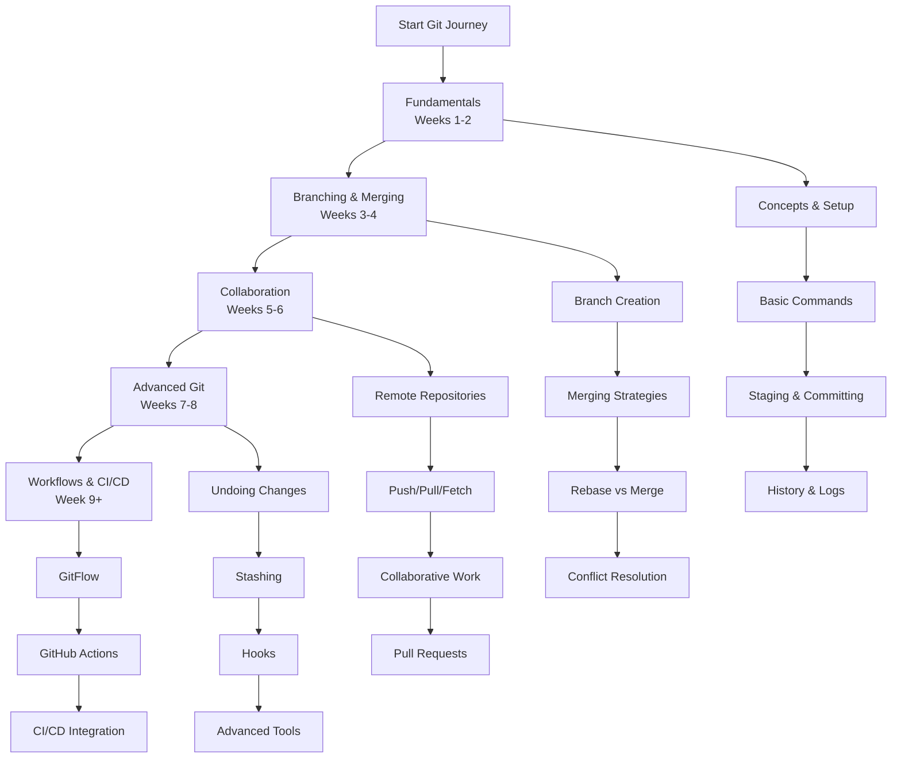

# Git Version Control Learning Path

This comprehensive roadmap provides a structured approach to mastering Git version control. The curriculum is designed sequentially, with each module building upon previous knowledge to ensure a solid foundation in version control practices.



---

## Phase 1: Git Fundamentals & Basic Concepts (Weeks 1-2)

*   [**Module 1: Introduction to Version Control**](https://github.com/example/git-intro/#readme)
    *   What is Version Control and why it's essential
    *   Centralized vs Distributed Version Control Systems
    *   Git history and design philosophy
    *   Common Git workflows and use cases
    *   Installing Git on different operating systems

*   [**Module 2: Git Configuration & Setup**](https://github.com/example/git-setup/#readme)
    *   First-time Git setup: `git config`
    *   User configuration: name, email, and editor settings
    *   Global vs Local configuration levels
    *   SSH key generation and authentication setup
    *   Basic Git help and command documentation

*   [**Module 3: Creating Repositories & Basic Commands**](https://github.com/example/git-repositories/#readme)
    *   Initializing a new repository: `git init`
    *   Cloning existing repositories: `git clone`
    *   Repository structure: working directory, staging area, repository
    *   Git file lifecycle: untracked, modified, staged, committed
    *   Checking repository status: `git status`

*   [**Module 4: Staging and Committing Changes**](https://github.com/example/git-committing/#readme)
    *   Staging files: `git add` (specific files, directories, all changes)
    *   Committing changes: `git commit` with meaningful messages
    *   Commit best practices: atomic commits and message conventions
    *   Skipping the staging area: `git commit -a`
    *   Viewing commit history: `git log` with various options

---

## Phase 2: Branching & Merging Strategies (Weeks 3-4)

*   [**Module 5: Branching Fundamentals**](https://github.com/example/git-branching/#readme)
    *   What are branches and why use them?
    *   Creating and switching branches: `git branch`, `git checkout`
    *   Modern branch switching: `git switch` and `git restore`
    *   Listing and deleting branches
    *   Understanding HEAD pointer and branch references

*   [**Module 6: Basic Merging**](https://github.com/example/git-merging/#readme)
    *   Fast-forward merges vs three-way merges
    *   Performing merges: `git merge`
    *   Merge commit messages and conflict indicators
    *   Best practices for merging branches
    *   Checking differences between branches: `git diff`

*   [**Module 7: Rebasing**](https://github.com/example/git-rebasing/#readme)
    *   Understanding rebase vs merge differences
    *   Interactive rebasing: `git rebase -i`
    *   Rebasing workflow and when to use it
    *   Squashing commits with rebase
    *   Dangers and benefits of rebasing

*   [**Module 8: Conflict Resolution**](https://github.com/example/git-conflicts/#readme)
    *   Understanding merge conflicts and their causes
    *   Conflict markers and how to read them
    *   Resolving conflicts manually
    *   Using merge tools for conflict resolution
    *   Aborting merges and rebases when needed

---

## Phase 3: Remote Repositories & Collaboration (Weeks 5-6)

*   [**Module 9: Working with Remote Repositories**](https://github.com/example/git-remote/#readme)
    *   Adding remote repositories: `git remote add`
    *   Viewing and managing remotes: `git remote -v`
    *   Pushing to remotes: `git push`
    *   Fetching from remotes: `git fetch`
    *   Pulling changes: `git pull` and its components

*   [**Module 10: Collaborative Workflows**](https://github.com/example/git-collaboration/#readme)
    *   Forking workflow vs feature branch workflow
    *   Creating and managing pull requests/merge requests
    *   Code review practices with Git
    *   Managing multiple remotes (origin, upstream)
    *   Syncing forked repositories

*   [**Module 11: Tags and Releases**](https://github.com/example/git-tags/#readme)
    *   Creating lightweight tags: `git tag`
    *   Creating annotated tags: `git tag -a`
    *   Pushing tags to remote: `git push --tags`
    *   Using tags for versioning and releases
    *   Checking out specific tags

*   [**Module 12: GitHub/GitLab/Bitbucket Platforms**](https://github.com/example/git-platforms/#readme)
    *   Creating repositories on hosting platforms
    *   README files, .gitignore, and license files
    *   Using issues and project boards
    *   Wiki and documentation features
    *   Social coding aspects: starring, watching, forking

---

## Phase 4: Advanced Git Techniques (Weeks 7-8)

*   [**Module 13: Undoing Changes**](https://github.com/example/git-undo/#readme)
    *   Unstaging files: `git reset`, `git restore --staged`
    *   Discarding working directory changes: `git checkout --`, `git restore`
    *   Amending commits: `git commit --amend`
    *   Reverting commits: `git revert` (safe method)
    *   Resetting commits: `git reset` (soft, mixed, hard)

*   [**Module 14: Stashing and Cleaning**](https://github.com/example/git-stashing/#readme)
    *   Stashing changes: `git stash` and `git stash push`
    *   Applying and popping stashes
    *   Managing multiple stashes
    *   Stashing untracked files and using options
    *   Cleaning working directory: `git clean`

*   [**Module 15: Git Hooks**](https://github.com/example/git-hooks/#readme)
    *   Understanding Git hooks and their types
    *   Client-side hooks: pre-commit, prepare-commit-msg
    *   Server-side hooks: pre-receive, update
    *   Creating custom hooks
    *   Hook management and best practices

*   [**Module 16: Advanced Tools & Techniques**](https://github.com/example/git-advanced/#readme)
    *   Interactive staging: `git add -p`
    *   Bisecting to find bugs: `git bisect`
    *   Worktree for multiple working directories
    *   Submodules for including other repositories
    *   Cherry-picking specific commits

---

## Phase 5: Git Workflows & Professional Practices (Week 9+)

*   [**Module 17: Git Workflow Strategies**](https://github.com/example/git-workflows/#readme)
    *   **GitFlow Workflow**: feature, release, hotfix branches
    *   **Trunk-Based Development**: short-lived feature branches
    *   **Forking Workflow**: open source collaboration model
    *   **Feature Branch Workflow**: team collaboration standard
    *   Choosing the right workflow for your project

*   [**Module 18: .gitignore Patterns**](https://github.com/example/git-ignore/#readme)
    *   Purpose of .gitignore files
    *   Global vs local .gitignore
    *   Pattern matching syntax and examples
    *   Common patterns for different languages/frameworks
    *   Ignoring already tracked files

*   [**Module 19: CI/CD Integration**](https://github.com/example/git-ci-cd/#readme)
    *   GitHub Actions workflows
    *   GitLab CI/CD pipelines
    *   Automated testing with Git hooks
    *   Deployment strategies with Git
    *   Quality gates and automated checks

*   [**Module 20: Enterprise Git Practices**](https://github.com/example/git-enterprise/#readme)
    *   Branch protection rules
    *   Code ownership and review requirements
    *   Signed commits and verification
    *   Audit trails and compliance
    *   Backup strategies and disaster recovery

---

## Cheat Sheet: Essential Git Commands

### Basic Workflow
```bash
git init                    # Initialize new repository
git clone <url>            # Clone existing repository
git status                 # Check repository status
git add <file>             # Stage specific file
git add .                  # Stage all changes
git commit -m "message"    # Commit staged changes
git log                    # View commit history
```

### Branching & Merging
```bash
git branch                 # List branches
git branch <name>          # Create new branch
git checkout <branch>      # Switch to branch
git switch <branch>        # Modern branch switching
git merge <branch>         # Merge branch into current
git rebase <branch>        # Rebase current branch onto target
```

### Remote Operations
```bash
git remote add origin <url>    # Add remote repository
git push -u origin main        # Push to remote and set upstream
git pull origin main          # Pull changes from remote
git fetch origin              # Fetch changes without merging
```

### Undoing Changes
```bash
git restore <file>           # Discard working directory changes
git restore --staged <file>  # Unstage file
git commit --amend          # Amend last commit
git reset --hard HEAD       # Reset to last commit (dangerous)
git revert <commit>         # Create undo commit
```

---

## Learning Resources

### Official Documentation
- [Pro Git Book](https://git-scm.com/book/en/v2) - Comprehensive free book
- [Git Official Documentation](https://git-scm.com/doc) - Command reference
- [GitHub Guides](https://guides.github.com/) - Platform-specific guides

### Interactive Learning
- [Learn Git Branching](https://learngitbranching.js.org/) - Visual branch learning
- [GitKat](https://gitkatas.com/) - Git practice exercises
- [Codecademy Git Course](https://www.codecademy.com/learn/learn-git)

### Practice Platforms
- [GitHub Skills](https://skills.github.com/) - Interactive GitHub learning
- [GitLab Tutorials](https://docs.gitlab.com/ee/gitlab-basics/) - GitLab specific
- [Atlassian Git Tutorials](https://www.atlassian.com/git)

Remember: Git proficiency comes from regular practice. Start with personal projects, contribute to open source, and gradually incorporate advanced workflows into your daily development process!
